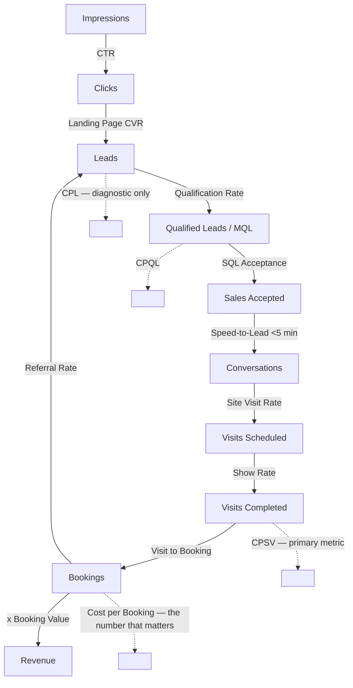
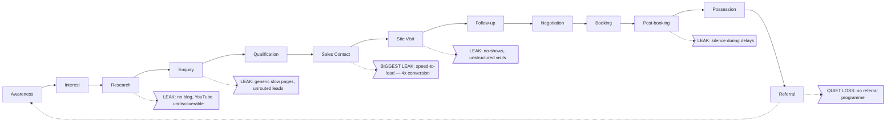
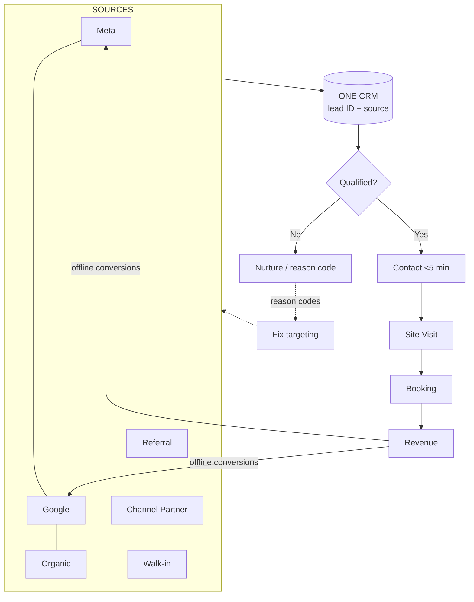

# Strategic Diagrams

Reference diagrams for the presentation and for internal working sessions. Mermaid blocks render directly; ASCII blocks are for terminal/markdown contexts.

---

## 1. The full marketing funnel



---

## 2. Reverse funnel — plan backwards from inventory

```
              BOOKING TARGET  (set by sales/finance)
                        │  ÷ visit→booking rate
              SITE VISITS REQUIRED
                        │  ÷ show rate
              VISITS TO SCHEDULE
                        │  ÷ qualified→visit rate
              QUALIFIED LEADS REQUIRED
                        │  ÷ qualification rate
              TOTAL LEADS REQUIRED
                        │  ÷ landing page CVR
              TRAFFIC REQUIRED
                        │  × CPC
              MEDIA SPEND REQUIRED
```

**The scenario spread — 60 bookings / ₹180 Cr revenue:**

| | Conservative | Base | Aggressive |
|---|---|---|---|
| Leads needed | 22,857 | 5,714 | 2,240 |
| Media spend | **₹32.0 Cr** | ₹4.9 Cr | **₹1.1 Cr** |
| Cost ratio | 17.8% | 2.7% | 0.6% |

**29× difference — none of it from media buying.** Funnel quality *is* the budget lever.

---

## 3. Customer journey with leak points



---

## 4. Marketing → Sales → Revenue closed loop



**The test:** leadership asks *"which campaign produced last month's bookings, and at what cost?"* and gets a dashboard answer, not a debate.

---

## 5. TRAYA positioning framework

```
                    HIGH DIFFERENTIATION
                            │
      (A) Certified         │      (C) Built for 2040
      Net-Zero Address   ●  │  ●   (E) Pays You Back
                            │
                       ●    │
                  (B) Proven│Delivery
   LOW ───────────────────── ┼ ───────────────────── HIGH
   DEFENSIBILITY            │                    DEFENSIBILITY
                            │
                            │  ●  (D) Capital-Region
                            │      Investment  ← REJECT
                            │      (commoditised; loses to plots)
                    LOW DIFFERENTIATION
```

**Recommended:** fuse **B + C + E**, evidenced by **A**. Demote **D** to a supporting line.

> *"Proven builders. Future-proof homes. In the capital region."*

---

## 6. Customer segmentation — yield vs cost

```
   HIGH │  ① Existing residents        ⑤ HNI / legacy
 YIELD  │     (cheapest, fastest)         (low volume, high value)
        │
        │           ② VJA/Guntur affluent
        │              (core volume)
        │
        │  ③ Hyderabad AP-origin    ④ NRI
        │     (structurally needed)    (needs infrastructure)
   LOW  │
        │  ✗ Plot speculators — EXCLUDED
        └────────────────────────────────────────
          LOW                            HIGH
                  COST TO ACQUIRE
```

---

## 7. Channel strategy — priority by contribution to bookings

```
HIGH   ┃ Referral & existing customers   ← cheapest, highest converting
       ┃ Channel partners                ← largest unmanaged relationship
       ┃ Google Search                   ← quality > cost at ₹3 Cr AOV
       ┃ Meta                            ← volume + audience building
       ┃ Website + CRM                   ← converts everything else
───────╂──────────────────────────────────────────────────────
MEDIUM ┃ SEO/content · YouTube · Remarketing · PR
       ┃ Site experience · Outdoor · LinkedIn · Email · Events
───────╂──────────────────────────────────────────────────────
LOW    ┃ Display · Influencer · Print · Radio · X
```

**Five HIGH channels only.** At ~60 bookings/year, focus beats coverage.

---

## 8. Brand architecture — current vs proposed

```
CURRENT (house of brands)          PROPOSED (endorsed branded house)

    KMV SPACES                          KMV GROUP
   (weak: 33 reviews)                (institutional heritage)
        │                                   │
   ┌────┼────┬────┐                    KMV SPACES
   │    │    │    │                  THE GUARANTOR
 VIVAAN │  TOWER TRAYA           (certifications, delivery)
(strong:│                                  │
 454    │                        ┌─────┬───┴───┬─────┐
ratings)│                      VIVAAN VIVAAN VIVAAN TRAYA
        │                      VILLAS  APTS  DISTRICT
 kmvvivaan.com                         │
 fb/kmvvivaan              "KMV SPACES presents TRAYA"
 → equity trapped              → equity compounds
```

---

## 9. The 90-day roadmap

```mermaid
gantt
    dateFormat X
    axisFormat Day %s
    section Days 1-30 AUDIT
    Baseline numbers + CRM audit      :0, 7
    Sales capacity + call listening   :0, 7
    Brand consolidation (free win)    :7, 14
    Funnel diagnosis + SLA            :14, 21
    Speed-to-lead <5 min live         :21, 30
    section Days 31-60 BUILD
    Landing pages + speed             :30, 44
    YouTube fix + content + film      :37, 51
    Partner programme + referral      :44, 58
    Controlled paid tests             :51, 60
    section Days 61-90 SCALE
    TRAYA launch                      :60, 74
    Site visit playbook               :67, 81
    Dashboard + closed loop           :74, 90
```



---

## 10. Marketing economics — why CPL is the wrong target

```
        SAME ₹10,00,000 SPEND

   CAMPAIGN A                    CAMPAIGN B
   CPL ₹500                      CPL ₹2,500
        │                             │
   2,000 leads                    400 leads
        │ 5% qualify                  │ 30% qualify
   100 qualified                  120 qualified
        │ 20% visit                   │ 45% visit
   20 site visits                 54 site visits
        │ 20% book                    │ 20% book
   4 BOOKINGS                     11 BOOKINGS
        │                             │
   ₹12 Cr revenue                 ₹33 Cr revenue
   ₹2,50,000/booking              ₹90,909/booking

   ✗ Wins every dashboard        ✓ Wins the business
     metric                        +₹21 Cr on identical spend
```

**Therefore: optimise cost per booking. CPL is a diagnostic, never a target.**
